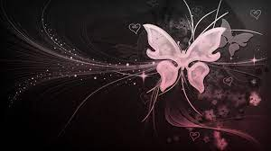
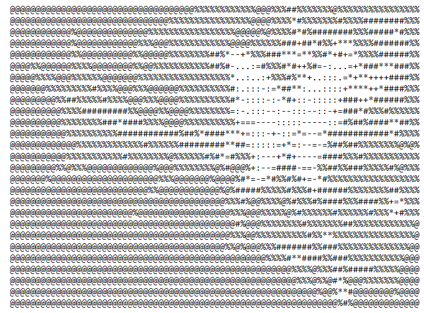
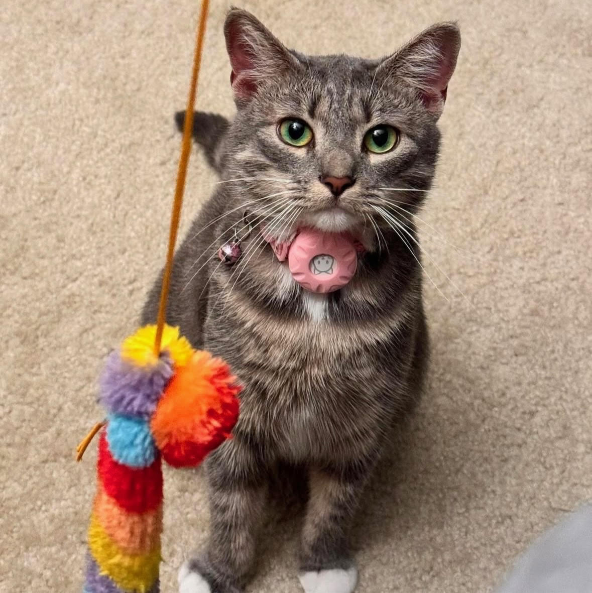
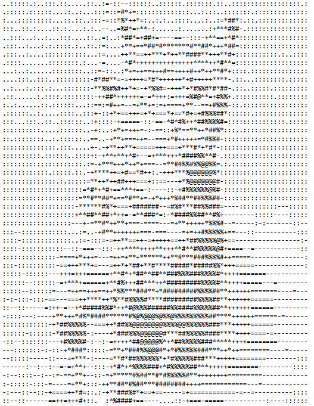
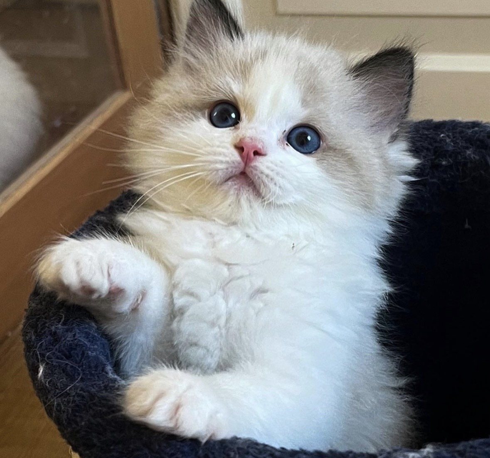
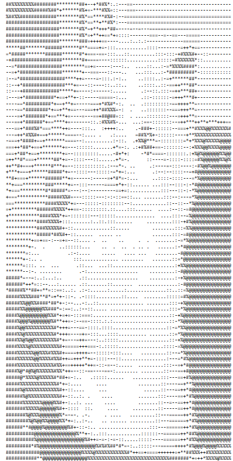

# Python-ASCII-Art
202403_Intro to Computer Vision_CSCI_6527_10_Project 2

### Authors:

- Aditi Vyas (GW ID: G40802010)

- Ritwika Das (GW ID: G30941802)

### Professor:

Robert Pless

## Problem Domain and Project Description

The ASCII Art Generator is designed to convert images into ASCII art using Python and the Pillow library, enabling a transformation of standard images into text-based visuals. The primary goal is to provide a simple yet effective tool for users to generate ASCII representations of pictures. The input to this system is any standard image file (e.g., JPG, PNG), and the output is a text file containing ASCII characters that visually represent the image.

This project is particularly useful for artists, developers, and educators who want to incorporate ASCII art into their work or learning environments. For example, developers might use this tool to generate creative display outputs for console applications, while educators might use it to introduce students to basic concepts in digital image processing and character encoding.

## Approach

The project employs a straightforward image processing technique that involves resizing the image to a manageable width, converting it to grayscale to simplify pixel intensity analysis, and then mapping each pixel's brightness to a specific ASCII character. This method allows for quick and intuitive transformations of images into ASCII art.

### Data and Tools

The ASCII Art Generator works with image data, utilizing the Pillow library to handle image manipulations. No external datasets are used as inputs are individual images provided by users. The simplicity of using ASCII characters to represent pixel brightness levels reduces the complexity often associated with more intricate image processing algorithms.

### Challenges

One challenge is the selection of ASCII characters that effectively represent various shades of gray, maintaining recognizable representations of the original images. The restricted resolution and grayscale conversion also pose limitations, as they can obscure finer details of the original image.

## Results

The ASCII Art Generator reliably transforms images into their ASCII art equivalents, maintaining a balance between simplicity and recognizability. While this approach does not incorporate advanced image processing techniques like machine learning models, it serves its intended purpose efficiently without the overhead of more complex systems. It is well-suited for educational purposes and simple artistic projects but may require enhancements for high-resolution artworks or applications needing finer detail.

### Original Image 1:

  

### ASCII Art Output 1:

### Analysis of the Images:

- The ASCII Art Generator managed to capture the general outline and form of the butterfly but struggles with fine details and gradients present in the original image. The output highlights the tool's capability to approximate complex elements in a minimalist format but also underscores the limitations in terms of detail and depth, which are hard to replicate with ASCII characters.

### Original Image 2:

  

### ASCII Art Output 2:

### Analysis of the Images:

- The first pair consisted of a photograph of a gray cat and its ASCII art representation. The original photograph captured the cat with detailed clarity, showcasing facial features and fur texture. The pink collar provided a vibrant contrast to the gray fur. The ASCII art conversions retained the general form of the cat but lost the subtleties of fur texture and color nuances. These elements were simplified into patterns of symbols, demonstrating the limitations of ASCII art in conveying complex textures and gradients.

  ### Original Image 3:

  

### ASCII Art Output 3:

### Analysis of the Images:

- The second pair included a photograph of a fluffy white-and-gray kitten and its ASCII representation. The original image featured the kitten with bright eyes and a soft coat, with distinct color contrasts enhancing its charm. The ASCII versions recognized primary features like the eyes and body outline but simplified the fluffy fur into basic strokes, losing much of the detail and softness. This pair exemplified ASCII art's challenges in rendering detailed textures and preserving the visual impact of high-contrast color variations.

## Summary

This project outlines the operation of the ASCII Art Generator, a Python project utilizing the Pillow library to convert images into ASCII art. The tool processes any standard image file, resizing and converting it to grayscale to simplify pixel intensity analysis, before mapping pixels to ASCII characters. This project is ideal for educational purposes and creative applications where textual visualization of images is desired.

The ASCII Art Generator is a Python project that utilizes the Pillow library to convert images into ASCII art. This tool processes any standard image file, applying resizing and grayscale conversion to simplify pixel intensity analysis before mapping pixels to ASCII characters. The project is particularly well-suited for educational purposes and creative applications where textual visualization of images is required. We have gained insights into the challenges of digital image processing, specifically the difficulties in maintaining detail and texture when converting images to a restricted ASCII character set. Additionally, it explored effective methods for representing visual data in a non-traditional format.

## Tools and Resources

- **Pillow Library**: For image processing tasks.
- **Python**: The programming language used to create the tool.
- **GitHub Repositories**: Inspired by various open-source projects on GitHub that demonstrated basic image manipulation techniques.
- **Stack Overflow**: Provided solutions for specific image processing issues encountered during development.

The project consists of Python script:

- **ascii_conversion.py**: Contains all the functions needed for the image manipulation processes such as resizing the image to a manageable width, converting it to grayscale, and mapping the grayscale pixels to ASCII characters.

## What we learnt

Throughout our ASCII Art Generator project, we learned to transform images into ASCII art using Python and the Pillow library, appreciating the simplicity and educational value of converting images through basic digital processing techniques. We encountered challenges in choosing ASCII characters that could accurately represent different shades of gray, which underscored the inherent limitations of ASCII art in preserving detailed textures and fine details. Despite these hurdles, we successfully created recognizable ASCII representations, which balanced simplicity and visual integrity well for educational and artistic purposes. Our experiences highlighted the need for more refined methods in applications demanding higher resolution and detail, offering valuable insights into the basic yet effective domain of image processing.

## Acknowledgments

Special thanks to the developers of the Pillow library for maintaining and documenting such a robust tool for image manipulation in Python. This project was inspired by various tutorials and code snippets from both Stack Overflow and GitHub, which provided the foundational knowledge needed to undertake this project.
